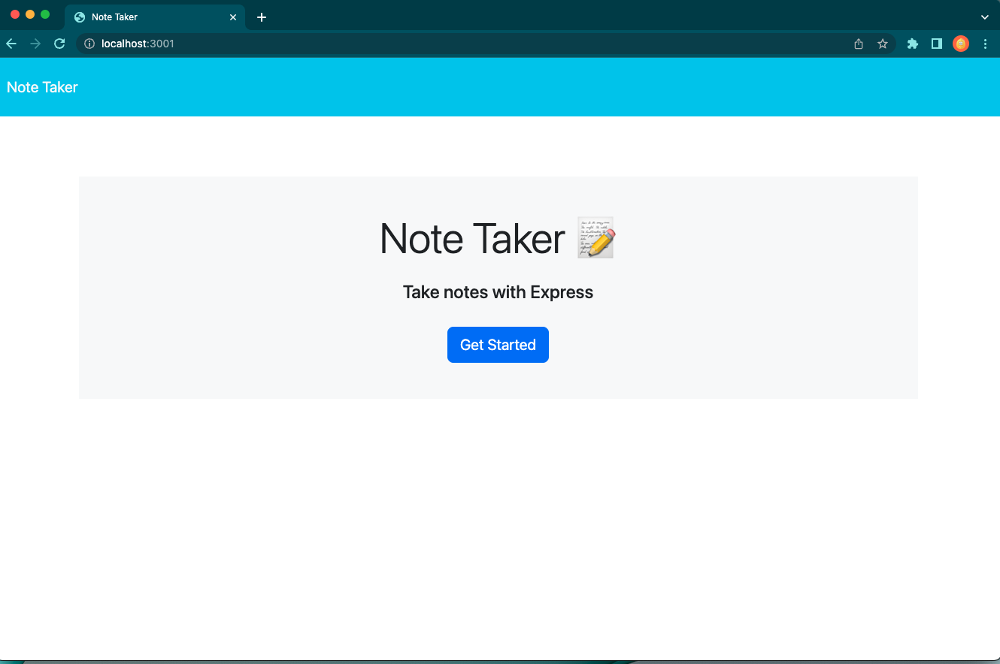
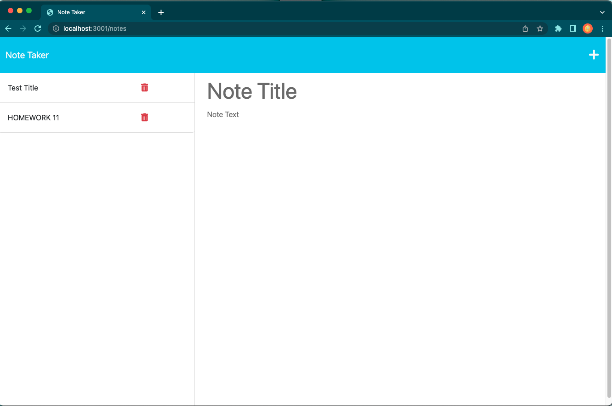
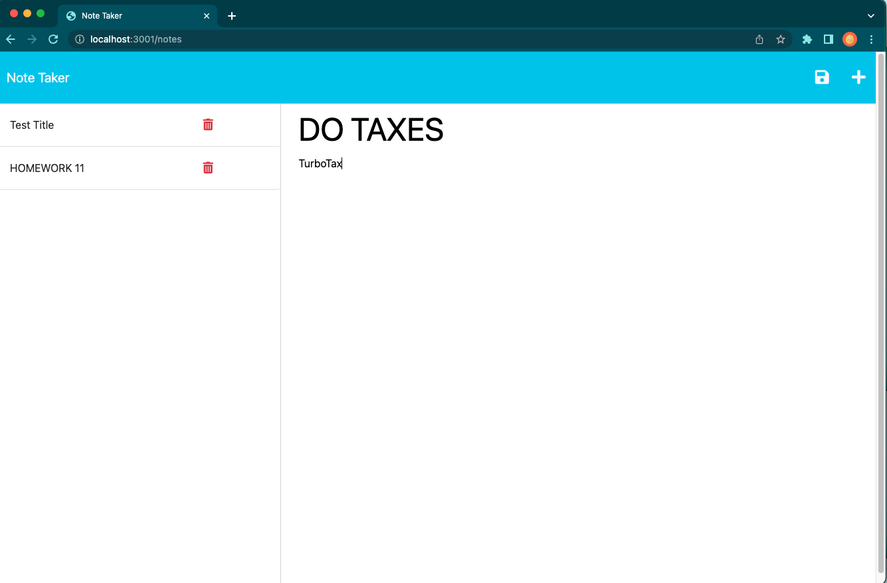
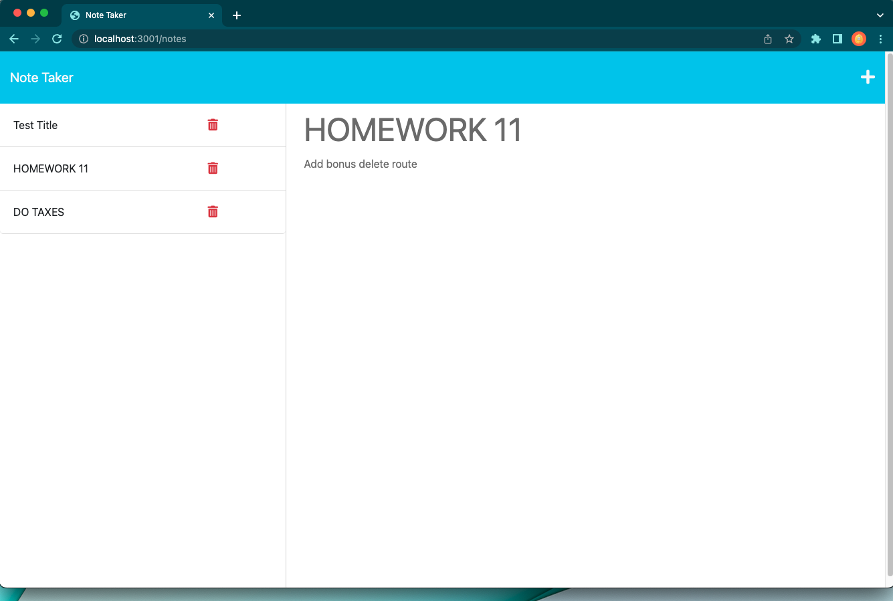

# Challenge11-Note-Taker

## Description

This project is a Note Taker that can be used to create, save, and retrieve notes as well as delete notes that no longer have any use for the user.  It utilizes the Express Node.js module in the back end and connects to an already existing front end created for note taking.  I created a server in the back end with routes using Express.js.  

The motivation behind this project is to take on the user story of: 
"AS a small business owner
I WANT to be able to write and save notes
SO THAT I can organize my thoughts and keep track of tasks I need to complete."

This project was built to resolve the problem of not having a catch-all for thoughts and tasks one may need to complete but cannot keep track of solely in their minds.  The Note Taker allows a place for organization so that a user can store notes, tasks, and anything that needs to be put in writing so that they can retrieve them later to be reminded or delete them if the note is no longer needed.  

In developing the Note Taker, I learned how to create a back end server and routes that a user can interact with on the front end through a web browser.  I have also expanded my knowledge of back end servers and steps necessary to take for front end interaction.  

LINK TO DEPLOYED APPLICATION: https://lit-citadel-10370.herokuapp.com/

## Installation
I ran npm i in the terminal to install node modules and dependencies.  This also installed the express package.  

## Usage

On the landing page of the Note Taker application, the user is presented with the home page presenting a "Get Started" button in the middle of the page, that when clicked on will link the user to the notes page.  

Once on the notes page, there is left column with existing notes previously populated and listed.  On the right column is an empty field to enter a new note title and note's text.

When a new note is entered with a new note title and that new note's text filled in, a save icon button appears in the nav bar at the top of the page.  When this save icon is clicked, that note is saved to the left side column with the existing notes.  

The user may also click on an existing note in the list of notes in the left side column and that note will appear in the right side column for viewing.  

If the user is viewing an existing note and wants to create a new note, they can click the "+" icon and a black field will appear in the right side column.  

Additionally, a delete button was also implemented in this app for existing notes that the user would like to delete.  If a user wants to delete a note, they can click the trash can icon in the existing notes lited in the left side column.  

## Credits

I would like to thank Ryan Fernandez for tutoring me and guiding me through the process of creating a back end server.  

## License

N/A

## Features

The delete note route has been added as a bonus feature to the project.  This allows the user to delete an existing note from the list in the left hand column.  

## Questions

If you have any questions, please contact me directly at pkfalberto@gmail.com.